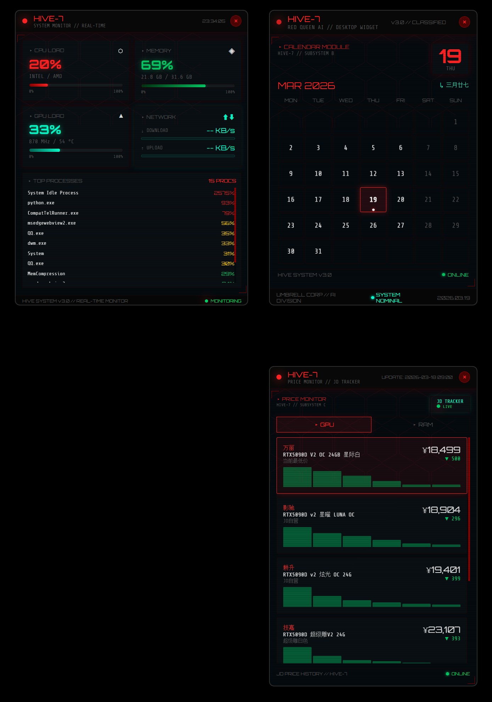

# HIVE-7 Red Queen Desktop Widgets

红皇后主题桌面控件 for Windows.



## 功能

- **日历控件** — 月视图、农历日期、今日高亮
- **价格监控** — GPU/RAM 价格走势 mini 图表、涨跌提醒
- **系统监控** — CPU / 内存 / GPU / 网络 / 进程占用

## 运行

```bash
pip install pywebview psutil
python redqueen_server.py
```

## 文件说明

| 文件 | 说明 |
|------|------|
| `redqueen_server.py` | 主启动器，同时打开三个窗口 |
| `redqueen_widget.html` | 日历控件 |
| `redqueen_price.html` | 价格监控控件 |
| `redqueen_sysmon.html` | 系统监控控件 |
| `redqueen_launch.py` | 单独启动日历控件 |
| `redqueen_wallpaper.png` | 红皇后主题壁纸 |
| `screenshot.png` | 效果截图 |

## 布局

- 右上：系统监控 + 日历（并排）
- 右下：价格监控

## 开机自启

将 `redqueen_start.bat` 放到启动文件夹。
